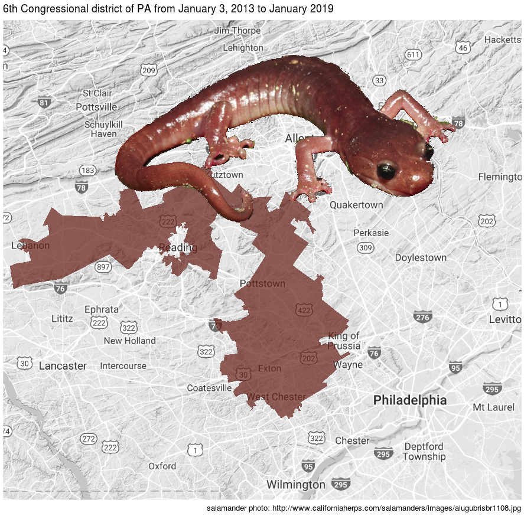

```{r echo=FALSE}
library(knitr)
opts_chunk$set(message = FALSE, warning = FALSE)
```

When Republicans or Demecrats are in charge, they tend to draw election disctrict boundaries to their favor. This can go very ugly, creating crazy boundaries by a practice called [Gerrymandering](https://en.wikipedia.org/wiki/Gerrymandering). 

The word "Gerrymander" is a combination of two species: the Massachusetts Governer Elbridge Gerry and a mythological salamander, a dragon-like monster. Governer Gerry signed a bill 200 year ago that drew an state senate election district in a shape resembling a salamander.

Nobody has seen the mythological salamander, but we are quite familiar with the amphibian salamander, which also has a dragon-like shape.  

One of my favorate Gerrymanderring example is the 6th congressional district of Pansylvania (115th congress). It has a shape vividly like a salamander.




We can visualize the gerrymandering easily with `ggtiger` package. The figure below shows a few congressional districts near Philadelpia in Pennsylvania for 115th Congress, including the 6th distric above and the (in)famous 7th congressional district.

```{r eval=TRUE}
# install ggtiger package from https://github.com/GL-Li/ggtiger
# devtools::install_github("GL-Li/ggtiger")
library(ggtiger)
library(viridis)

# download map near philly in PA
philly <- get_map("pottstown, PA,  usa", zoom = 9, color = "bw")

### congressional district boudaries
ggmap(philly) +
    geom_boundary("congressional district", states = "PA",
                  mapping = aes(fill = ..GEOID..),
                  alpha = 0.7, color = "red", size = 0.3) +
    scale_fill_viridis(discrete = TRUE)

```

We can do this for any locations, for example Texas.

```{r}
tx <- get_map("san antonio, texas, usa", zoom = 8, color = "bw")
ggmap(tx) +
    geom_boundary("congressional district",
                  mapping = aes(fill = ..GEOID..),
                  alpha = 0.7, color = "red", size = 0.3) +
    scale_fill_viridis(discrete = TRUE)
```

